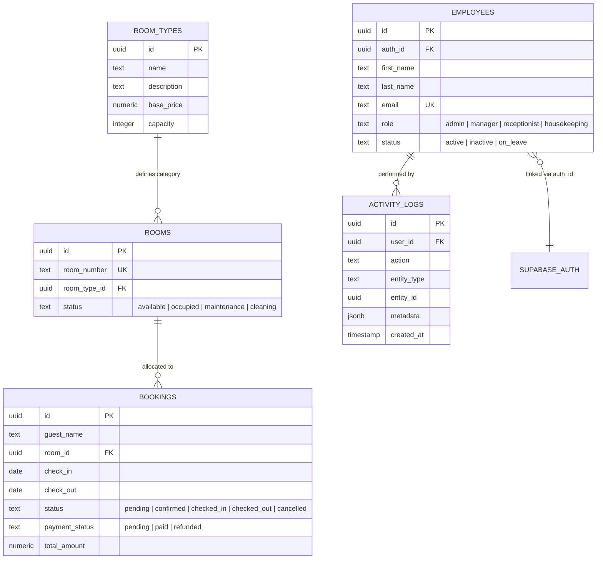

# Brookvalley Hotel Management System (HMS) - Master Technical & Architecture Documentation

> **Document Version:** 1.0.0  
> **Target Audience:** Senior Software Engineers, Technical Leads, Architects, and Development Team  
> **Last Updated:** August 2026  
> **Status:** Production Ready  

---

## 📋 Executive Summary

The **Brookvalley Hotel Management System (HMS)** is an enterprise-grade, web-based property management platform engineered to streamline and automate end-to-end hotel operations. Built on a modern tech stack centered around **Next.js 16 (App Router)**, **React 19**, **TypeScript**, and **Supabase (PostgreSQL with Row-Level Security)**, the system provides hotel managers, receptionists, and administrative staff with real-time operational visibility.

Key business functions supported:
- **Reservation & Booking Lifecycle:** Booking creation, guest details, check-in/check-out execution, payment status tracking, and automated room status transitions.
- **Visual Room Timeline Calendar:** Grid-based visualization of room allocations across custom date ranges.
- **Inventory & Housekeeping Management:** Room classification, base pricing, capacity configuration, and housekeeping workflow tracking (`available`, `occupied`, `maintenance`, `cleaning`).
- **Employee Directory & Role-Based Access Control (RBAC):** Multi-tier access management (`admin`, `manager`, `receptionist`, `housekeeping`) with self-deactivation guardrails.
- **Financial Analytics & Operational Reporting:** Revenue reporting, occupancy trends, and transaction history.
- **Immutable Audit Trail:** Automated activity logging for system-wide auditing and compliance.
- **Automated Backup & Disaster Recovery:** Scheduled local/cloud database snapshots (`pg_dump`), Firebase fallback synchronization, and AWS S3 document replication.

---

## 🛠️ Technology Stack Overview

| Category | Technology | Version / Tooling | Purpose & Description |
| :--- | :--- | :--- | :--- |
| **Frontend Framework** | Next.js | `^16.2.10` (App Router) | Server and Client Component rendering, Server Actions, Edge middleware routing |
| **UI Library** | React | `^19.2.7` | UI component tree management, custom hooks, context providers |
| **Language** | TypeScript | `^5.3.3` | Strict static typing across domain models, service APIs, and React props |
| **Database & Auth** | Supabase (PostgreSQL) | `@supabase/supabase-js ^2.110.2`<br>`@supabase/ssr ^0.12.0` | Relational database, Supabase Auth (JWT), Row Level Security (RLS), Storage buckets |
| **Dual Sync / Fallback** | Firebase SDK | `firebase ^12.17.1` | Auxiliary data synchronization and real-time backup layer |
| **Cloud File Storage** | AWS S3 SDK | `@aws-sdk/client-s3 ^3.1085.0` | Offsite storage for payment proofs, guest IDs, and automated DB dump archives |
| **Styling & Icons** | CSS3 & Lucide React | `lucide-react ^1.23.0` | Modular system CSS, responsive design, dark/light theme tokens, vector icon sets |
| **Validation** | Zod | `zod ^4.4.3` | Runtime schema validation for API inputs, forms, and service payloads |

---

## 📐 System Architecture & Design Patterns

### 1. Feature-Based Modular Architecture (`features/`)
To prevent codebase spaghetti and enforce high cohesion with low coupling, the project follows a **Feature-Based Architecture**. Domain logic is modularized into discrete subdirectories within `features/`.

Each feature folder is self-contained:
```text
features/bookings/
├── components/          # UI Modals, Forms, Tables specific to Bookings
├── services/            # Database abstraction (`bookingsService.ts`)
├── types/               # Local domain types and schema interfaces
└── index.ts             # Barrel export defining the feature's public API
```

**Barrel Export Rule:** External components or features must only import from `@/features/<feature-name>` (the root `index.ts` file). Deep relative imports into another feature's internal components or services are strictly prohibited.

```typescript
// ✅ Good: Clean public interface access
import { bookingsService, BookingModal } from '@/features/bookings';

// ❌ Bad: Deep internal coupling
import { bookingsService } from '@/features/bookings/services/bookingsService';
```

### 2. Service Layer Pattern (`services/` & `features/*/services/`)
Database queries are decoupled from UI components. React components invoke domain services rather than directly querying Supabase.

**Benefits:**
- **Single Source of Truth:** Centralized logic for side-effects (e.g., changing booking status automatically updates room status to `cleaning`).
- **Standardized Error Handling:** Service calls handle Supabase error responses and throw consistent TypeScript error structures.
- **Maintainability & Testability:** Enables easy mocking in unit testing suites (Vitest).

### 3. Authentication & Edge Middleware Synchronization
Supabase Auth uses client-side JWT storage. To allow Next.js App Router server components and middleware to authenticate routes cleanly:

1. **`contexts/AuthProvider.tsx`**: Listens to Supabase `onAuthStateChange`. Upon login, it writes a secure HTTP/Cookie `sb-access-token` containing the JWT access token.
2. **`middleware.ts`**: Runs at the Next.js Edge layer. It inspects incoming requests for `sb-access-token`. Unauthenticated requests attempting to access protected dashboard routes (`/dashboard`, `/bookings`, `/employees`, `/settings`) are immediately redirected to `/login`.

---

## 📁 Repository Directory Structure

```text
brookvalley-hms/
├── app/                                  # Next.js App Router root
│   ├── (dashboard)/                      # Protected route group with common layout & sidebar
│   │   ├── bookings/page.tsx             # Reservations dashboard & table view
│   │   ├── calendar/page.tsx             # Interactive room timeline grid
│   │   ├── dashboard/page.tsx            # Key metrics, stats, & operational summary
│   │   ├── employees/page.tsx            # Staff directory & role configuration
│   │   ├── reports/page.tsx              # Financial analytics & export reporting
│   │   ├── settings/page.tsx             # Room inventory & price tier management
│   │   └── layout.tsx                    # Shared header, navigation sidebar, & auth wrapper
│   ├── login/page.tsx                    # Staff login view
│   ├── globals.css                       # Global design system tokens & utility CSS
│   ├── layout.tsx                        # Root HTML shell, fonts, & global providers
│   └── page.tsx                          # Base entry point (redirects to /dashboard)
├── docs/                                 # Central Documentation Hub
│   ├── API_AND_SERVICES.md               # Detailed service layer specifications
│   ├── ARCHITECTURE.md                   # Modular design & system patterns
│   ├── BACKUP_POLICY.md                  # Backup schedules, recovery drills, & S3 scripts
│   ├── DATABASE_SCHEMA.md                # PostgreSQL tables, relations, & RLS policies
│   ├── GETTING_STARTED.md                # Developer onboarding & env configuration
│   ├── PROJECT_DOCUMENTATION.md          # 🌟 Master documentation (This document)
│   ├── SUPABASE_MIGRATION_GUIDE.md       # Historical Firebase -> Supabase migration notes
│   └── TESTING.md                        # Vitest & Playwright testing strategy
├── features/                             # 🌟 Feature Domain Modules
│   ├── bookings/                         # Reservations, check-in/out logic
│   ├── calendar/                         # Visual timeline grid & room scheduler
│   ├── dashboard/                        # Metrics calculation & quick actions
│   ├── employees/                        # Staff management & RBAC settings
│   ├── reports/                          # Financial graphs & export generators
│   └── settings/                         # Room inventory & price tier management
├── constants/                            # Shared System Enums & Immutable Models
│   └── index.ts                          # BOOKING_STATUS, ROOM_STATUS, USER_ROLE constants
├── contexts/                             # React Context State Managers
│   └── AuthProvider.tsx                  # Supabase auth listener & JWT cookie synchronizer
├── lib/                                  # Infrastructure Helpers & Client Instantiations
│   ├── auth.ts                           # Auth helper hooks
│   ├── dateUtils.ts                      # Standardized date formatting helpers
│   ├── storage.ts                        # File upload handlers (proofs/IDs)
│   └── supabase.ts                       # Supabase client singletons (browser & server)
├── scripts/                              # Maintenance, Backup & Automation Scripts
│   ├── backupDatabase.js                 # Local pg_dump automated script
│   ├── backupFullSystem.js               # Full system DB + storage archiving engine
│   ├── restoreDatabase.js                # Database restoration script
│   ├── startBackupScheduler.js           # Cron runner for periodic backups
│   └── syncToFirebase.js                 # DB mirror script to Firebase
├── types/                                # Global TypeScript Interface Definitions
│   └── index.ts                          # Core models (Booking, Room, Employee, Log)
├── middleware.ts                         # Edge route guard & session validator
├── next.config.js                        # Next.js build options
└── package.json                          # Package dependencies & npm script runner
```

---

## 🗄️ Database Schema & Security Architecture

The database is built on **Supabase PostgreSQL**, leveraging **Row-Level Security (RLS)** to enforce strict data isolation.



### Core Entity Definitions

1. **`bookings`**: Stores reservation details, dates, financial amounts, and status flags.
2. **`rooms`**: Manages physical room units, numbers, and operational state.
3. **`room_types`**: Master catalog of room tiers, base rates, and occupancy rules.
4. **`employees`**: Staff profile records, mapped to Supabase Auth (`auth_id`) and assigned explicit roles (`USER_ROLE`).
5. **`activity_logs`**: Immutable, append-only log capturing user actions (e.g., `BOOKING_CREATED`, `EMPLOYEE_ROLE_UPDATED`) along with JSON metadata.

### Row Level Security (RLS) Policy Model

- **Default Stance:** Deny all access to unauthenticated requests.
- **Operational Staff (`receptionist`, `housekeeping`):** `SELECT` access on `rooms`, `room_types`, and `bookings`. `INSERT`/`UPDATE` access on `bookings` and room statuses.
- **Administrative Staff (`admin`, `manager`):** Full `ALL` access across `employees`, `room_types`, financial reports, and system settings.
- **Self-Account Safety Rule:** Backend policies and front-end service guards prevent admin users from deactivating or demoting their own active staff account to avoid system lockout.

---

## ⚡ Core Domain Subsystems & Workflows

### 1. Booking Lifecycle Management
```text
[Guest Inquiry] ➡️ [Create Pending Booking] ➡️ [Payment Confirmation] ➡️ [Check-In] ➡️ [Check-Out]
                                                                                              ⬇️
                                                                                 [Set Room to 'cleaning']
                                                                                              ⬇️
                                                                                 [Housekeeping Finishes]
                                                                                              ⬇️
                                                                                 [Set Room to 'available']
```
- **Automatic Room State Propagation:** When a booking transitions to `checked_in`, the associated room status automatically switches to `occupied`. When checked out, the room switches to `cleaning`.

### 2. Interactive Room Timeline Calendar
- Renders an interactive 30-day visual matrix mapping physical rooms along the Y-axis and dates along the X-axis.
- Color-codes booking blocks based on status (`confirmed` = emerald, `pending` = amber, `checked_in` = blue).
- Supports quick double-click to allocate empty slots or modify existing reservation boundaries.

### 3. Employee Management & RBAC
- Role Hierarchy:
  - **`admin`**: Full system permissions, employee creation, rate changes, system backups.
  - **`manager`**: Management of bookings, reports, room status overrides, staff views.
  - **`receptionist`**: Desk operations, creating/updating bookings, guest check-in/out.
  - **`housekeeping`**: View room statuses and update cleaning/maintenance states.

### 4. Activity & Audit Logging Subsystem
Every state-mutating operation invokes `activityLogger.logAction()`.
- Captures: `user_id`, `action`, `entity_type`, `entity_id`, and `metadata` (before/after state diffs).
- Displayed in real-time within the admin dashboard to ensure accountability.

---

## 🛡️ Backup, Restore & Resilience Infrastructure

The system employs a **3-2-1 Backup & Data Protection Policy**:

```text
               +----------------------------------+
               |  Primary Database (Supabase)     |
               +----------------------------------+
                                |
        +-----------------------+-----------------------+
        |                                               |
        v                                               v
+-------------------------------+               +-------------------------------+
| Daily Automated local pg_dump |               | Firebase Realtime Mirror Sync |
| (Retained 30 Days)            |               | (npm run sync:firebase)       |
+-------------------------------+               +-------------------------------+
        |
        v
+-------------------------------+
| AWS S3 Glacier Offsite Backup |
| (Retained 90 Days)            |
+-------------------------------+
```

### Automation Tools (`scripts/`)
- **`npm run db:backup`**: Executes `pg_dump` with gzip compression for PostgreSQL tables.
- **`npm run db:backup:full`**: Archives database schema, table data, and bucket file manifests into a timestamped directory under `backups/`.
- **`npm run backup:auto`**: Node-based cron worker running background snapshot jobs every 24 hours at 02:00 UTC.
- **`npm run db:restore`**: Automated drill script for verifying recovery onto a staging database.
- **`npm run sync:firebase`**: Secondary synchronization pipeline creating JSON document mirrors in Firebase Firestore for multi-cloud redundancy.

---

## 🚀 Running, Testing & Deployment

### Environment Configuration (`.env.local`)
Required environment variables:
```bash
# Supabase Configuration
NEXT_PUBLIC_SUPABASE_URL="https://your-project.supabase.co"
NEXT_PUBLIC_SUPABASE_ANON_KEY="your-anon-key"
SUPABASE_SERVICE_ROLE_KEY="your-service-role-key"

# AWS S3 Storage Backup Configuration
AWS_REGION="us-east-1"
AWS_ACCESS_KEY_ID="your-aws-key-id"
AWS_SECRET_ACCESS_KEY="your-aws-secret"
AWS_S3_BUCKET_NAME="brookvalley-hms-backups"

# Firebase Redundancy Configuration
NEXT_PUBLIC_FIREBASE_API_KEY="your-firebase-api-key"
NEXT_PUBLIC_FIREBASE_PROJECT_ID="your-firebase-project-id"
```

### Command Reference

| Command | Action |
| :--- | :--- |
| `npm run dev` | Starts Next.js development server on `http://localhost:4000` |
| `npm run build` | Compiles production Next.js build with static optimization and TypeScript checks |
| `npm run start` | Serves production build on port 4000 |
| `npm run db:backup` | Triggers an immediate database dump script |
| `npm run db:backup:full` | Triggers full system database + storage snapshot archive |
| `npm run backup:auto` | Starts the background backup cron runner |
| `npm run db:restore` | Runs database restoration drill on target environment |
| `npm run sync:firebase` | Syncs PostgreSQL records to Firebase secondary storage |

---

## 💡 Key Architectural Talking Points for Senior Engineers

When discussing this codebase with Senior Engineers, highlight the following design highlights:

1. **Clean Architecture Isolation:** The domain core is decoupled into `features/`. UI components remain lightweight presentational layers, while business logic lives inside type-safe service classes.
2. **Robust Security Posture:** Security is pushed to the database layer via Supabase PostgreSQL RLS. Edge Middleware guards server routes before rendering.
3. **Data Integrity & Consistency:** Room state transitions automatically stay synchronized with booking states (e.g., automated transition to `cleaning` upon check-out).
4. **Disaster Preparedness:** Enterprise backup infrastructure featuring automated daily compressed dumps, S3 cold storage replication, and Firebase multi-cloud mirroring.
5. **Developer Experience (DX):** Full TypeScript end-to-end type safety, centralized constants preventing string drift, and clear modular structure.

---

*This document serves as the canonical reference for the Brookvalley Hotel Management System codebase.*
